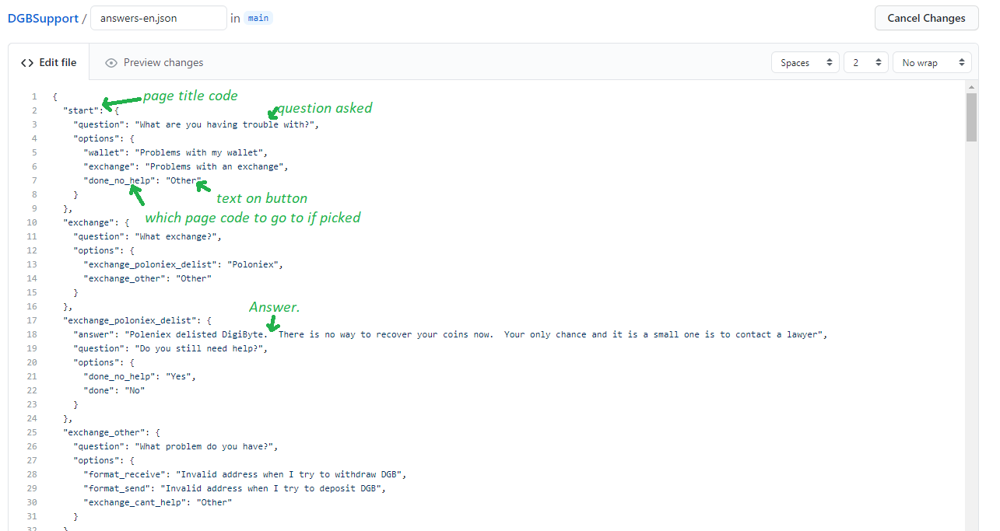

# DGBSupport

please feel free to add refrence data to this help tool



supportFiles can be full html code.  Images can be refrenced using ``````
If you need a " symbol in an answer type \\"
Page codes should only use lower case letters, numbers and underscore(_)

If transalating please clone the supportFiles-en.json and create a new file named supportFiles-country code.json only values to the right of the : per line should be translated.
To find out your country code, go to [this wikipedia link](https://en.wikipedia.org/wiki/List_of_ISO_639-1_codes) and look in the "639-1" cell.
